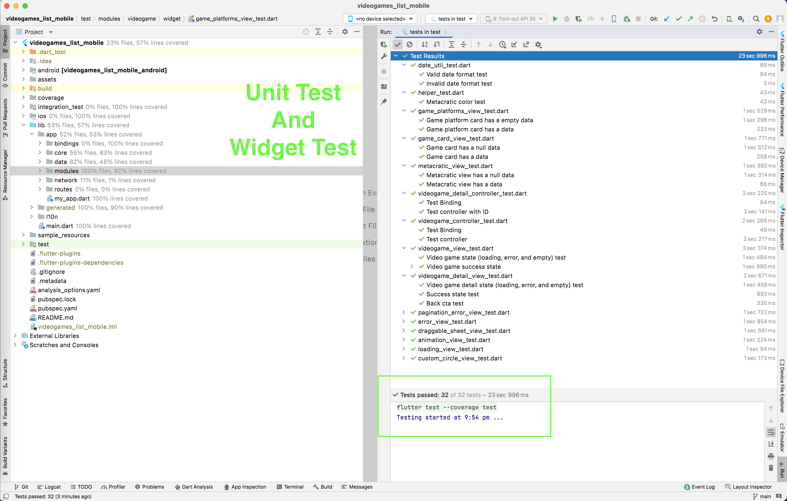

# Video Games List
This repository demonstrate the Video Games List Mobile App that implements using GetX and DIO.

### App Walkthrough:


### Structure in modules

1. **app:** It contains all the modules, bindings, routes, and remote calls that can interact with UI components.
   1. **bindings**: Initial level bindings
   2. **core**: Responsible for reusable components, themes, values, and utility.
   3. **data**: Directory responsible for containing everything related to our data.
   4. **modules**: Each module consists of a page, its respective GetXController, and its dependencies or Bindings.
   5. **network**: Responsible for managing all network operations and their error handling.
   6. **routes**: Storing all the navigation route paths.
   7. **my_app.dart**: Initial material app setup (Routes, Localization, Theme).
2. **I10n:** Localization.
3. **main.dart:** Entry point.

## Getting started

Follow the steps to run the project.

```shell
1. git clone https://github.com/imhemantsharma/videogames_list_mobile.git
2. cd videogames_list_mobile/
3. flutter pub get
4. open I10n/intl_en.arb file and save. It will generate the intl instance.

5. flutter run
```

After the successful execution of the command, App will run on the connected device (Android/iOS)

Note: If some error occurred while executing the steps then please check the prerequisite info

## Developing

### Built With
1. **Flutter:** https://docs.flutter.dev/development/tools/sdk/releases?tab=windows
3. **GetX:** https://pub.dev/packages/get
4. **Dio:** https://pub.dev/packages/dio

### Prerequisites

**Flutter Intl:** Install the plugin in Android Studio or VS Code.
1. **Android studio:** https://plugins.jetbrains.com/plugin/13666-flutter-intl
2. **VS code:** https://marketplace.visualstudio.com/items?itemName=localizely.flutter-intl

**Flutter Doctor:**
```
[✓] Flutter (Channel stable, 3.3.2, on macOS 12.3.1 21E258 darwin-x64, locale en-GB)
    • Flutter version 3.3.2 on channel stable at /Users/deq/development/flutter
    • Upstream repository https://github.com/flutter/flutter.git
    • Framework revision e3c29ec00c (4 weeks ago), 2022-09-14 08:46:55 -0500
    • Engine revision a4ff2c53d8
    • Dart version 2.18.1
    • DevTools version 2.15.0

[✓] Android toolchain - develop for Android devices (Android SDK version 32.1.0-rc1)
    • Android SDK at /Users/deq/Library/Android/sdk
    • Platform android-33, build-tools 32.1.0-rc1
    • Java binary at: /Applications/Android Studio.app/Contents/jre/Contents/Home/bin/java
    • Java version OpenJDK Runtime Environment (build 11.0.12+0-b1504.28-7817840)
    • All Android licenses accepted.

[✓] Xcode - develop for iOS and macOS (Xcode 13.2.1)
    • Xcode at /Applications/Xcode.app/Contents/Developer
    • Build 13C100
    • CocoaPods version 1.11.2

[✓] Chrome - develop for the web
    • Chrome at /Applications/Google Chrome.app/Contents/MacOS/Google Chrome

[✓] Android Studio (version 2021.2)
    • Android Studio at /Applications/Android Studio.app/Contents
    • Flutter plugin can be installed from:
      🔨 https://plugins.jetbrains.com/plugin/9212-flutter
    • Dart plugin can be installed from:
      🔨 https://plugins.jetbrains.com/plugin/6351-dart
    • Java version OpenJDK Runtime Environment (build 11.0.12+0-b1504.28-7817840)

[✓] VS Code (version 1.71.2)
    • VS Code at /Applications/Visual Studio Code.app/Contents
    • Flutter extension version 3.48.0
```

### Tests

#### **Unit/Widget test result:**

Follow the steps to execute the all unit/widget test.

```
1. open terminal
2. cd/videogames_list_mobile
3. flutter pub get
4. flutter test --coverage
```



**Official Doc:** https://docs.flutter.dev/cookbook/testing/widget

#### **Integration test result:**

Follow the steps to execute the integration test on the default connected device.

```
1. open terminal
2. cd/videogames_list_mobile
3. flutter pub get

To run all tests in this directory on the default device, run:
4. flutter test integration_test
```


**Official Doc:** https://docs.flutter.dev/testing/integration-tests#running-using-the-flutter-command

## **Api Reference**
Fetch the data from RAWG Video Games Database API [https://api.rawg.io/docs/](https://api.rawg.io/docs/). RAWG is an **OpenAPI-compliant free API**, you can download the OpenAPI/Swagger specification from the same link.


### **Fetch latest Playstation 5 games:**
[https://api.rawg.io/api/games?page=1&page_size=20&platforms=187&dates=2020-12-21,2021-12-21&ordering=-released&key=02ef6ba5d13444ee86bad607e8bce3f4](https://api.rawg.io/api/games?page=1&page_size=20&platforms=187&dates=2020-12-21,2021-12-21&ordering=-released&key=02ef6ba5d13444ee86bad607e8bce3f4)

Query Explanation:
- `https://api.rawg.io/api/games`: Games endpoint
- `page=1`: Page 1 of results
- `page_size=20`: Limit the resuts to 20 at a time
- `platforms=187`: Playstation 5 platform
- `dates=2020-10-09,2022-10-09`: Start date, end date. Limits the results to 1 year timeframe. Replace end date with the current date, replace start date minus 1 year from current date.
- `ordering=-released`: Sort by released descending
- `key=02ef6ba5d13444ee86bad607e8bce3f4`: Replace the key with yours (if any)

### **Fetch details of a game (In this case, FIFA 21):**
[https://api.rawg.io/api/games/437049?key=02ef6ba5d13444ee86bad607e8bce3f4](https://api.rawg.io/api/games/437049?key=02ef6ba5d13444ee86bad607e8bce3f4)

Query Explanation:
- `https://api.rawg.io/api/games/`: Games endpoint
- `437049`: Game ID for 'FIFA 21'
- `key=02ef6ba5d13444ee86bad607e8bce3f4`: Replace the key with yours (if any)

> Highly suggest the candidate get an API key as it is free, just follow the link above. But you can also use ours provided it has not run out of requests or expired: 02ef6ba5d13444ee86bad607e8bce3f4

